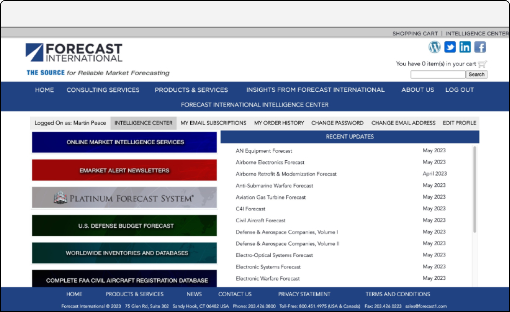
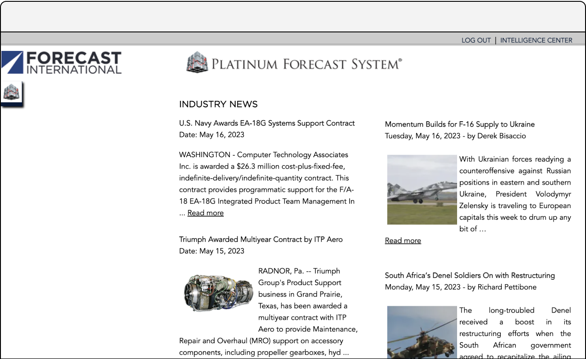
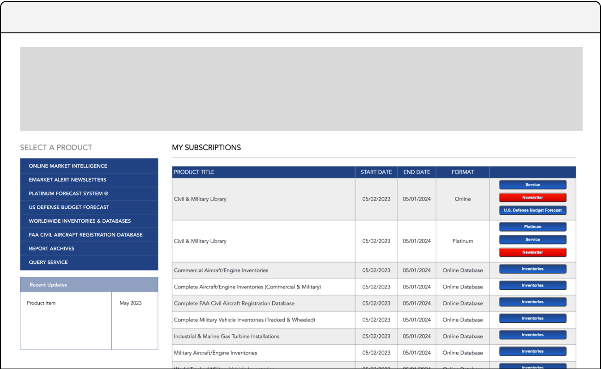
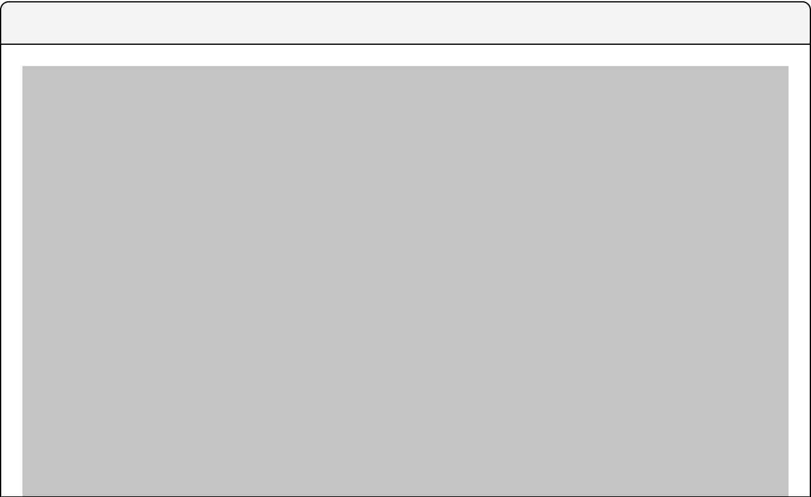
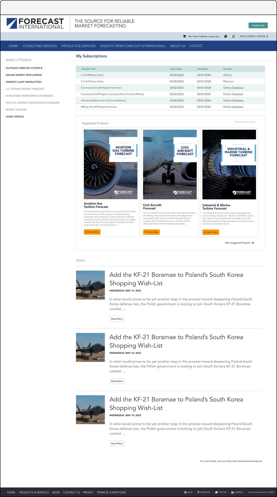
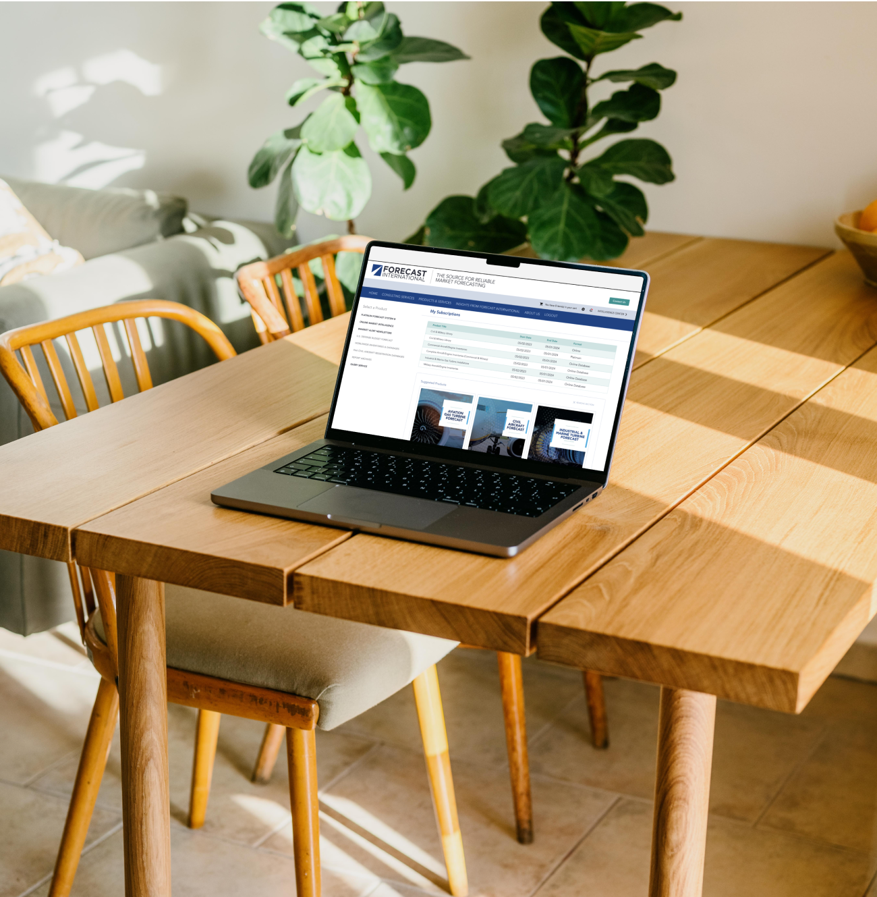

<h3>Redesigning the premier provider of market intelligence forecasting and proprietary research in Aerospace, Defense, Electronics and Power Systems industries.</h3>

<ul>
	<li>Project Completed 2023</li>
	<li>Project Role UX/UI, Branding, User Research, Management, Information Architecture</li>
</ul>

<h4>Background</h4>

I was working with a market forecasting company to update and improve their digital products and marketing site. As part of a post-acquisition integration initiative, we finalized this project in the fall of 2022, streamlining their existing products to integrate effortlessly with established product lines and brand experiences.

However, their products were encountering challenges, specifically, stagnant user growth and engagement.  Identifying the root cause and potentially addressing this issue became critical in light of the merger. 

<h4>Problem</h4>

Our primary objective in undertaking this project was to investigate the reasons behind the stagnation in user growth and engagement. The team conducted a user survey, distributing a concise questionnaire to our existing  user base. The survey aimed to understand why users utilized the product they paid for and their overall satisfaction with it. 

The insights identified from this survey were invaluable, revealing that users found the product unattractive, challenging to navigate, and outdated in appearance. However, they also expressed a strong appreciation for the valuable data provided by the platform, which motivated them to maintain their memberships. Armed with this information, we were poised to devise a solution.

<h4>Process</h4>

The market forecasting system, had legacy constraints and would place a number of limits on the design. Because of this, the redesign was staged into three phases. We would coordinate together but deploy at each phase finish. An internal product redesign, an updated and moved database, and a newly redesigned homepage.  

I started our design process with kickoff meetings that included our developers and key stakeholders. We identified key design constraints that we would need to account for and planned out a tentative schedule for the project deliverables. The project was broken into three smaller projects to manage feature scope and build out. 

Product audits for brand consistency, user experience and accessibility were then completed and analyzed. Through the audit reviews we learned that the product was not meeting the minimum of accessibility standards and had inconsistent branding. 

Once we finished our requirements gathering we moved onto create initial skeleton layouts that we would also use to reduce some of the user flows that had not been clearly identify. In one instance, reducing a user signup flow from 5 steps to 2 steps.  

I finalized designs and created handoff documents for the developers. We continued to have weekly check-in meetings to Q/A the different components that had been completed and address any questions that developers had of the designs.

Following handoff, I moved onto phase two , redesigning the product homepage and website.

<h4>Project Hurdle?</h4>

Three total rounds of design were completed. These included formal reviews where I would present the different design solutions to the stakeholders and collect feedback. This was the longest and most difficult part of the project. 

I did not consider the number of voices that would ultimately be allowed in each of the meetings and also didnt anticipate how long some of the later dates could be pushed back.

Each time we had a review, new stakeholders, would be invited and create a sort of new person doesn't have all the info for why we are here. I would need to start over in some respects explaining the different constraints and challenges the project faced.

I also explored building this app out for mobile but found that over 90% of the users were accessing the product from their desktop.

<h4>Solution & Takeaways</h4>

The biggest outside influence on this project was the development constraints placed on the design. The design had to fit into existing product structures. 

The final design, seen below, included:

<ul>
	<li>updated interface</li>
	<li>updated brand assets</li>
	<li>reduced fonts and font weights</li>
	<li>expanded usable color palette to meet accessibility standards and improved user experience</li>
	<li>improved primary and secondary user flows for improved lead generation and new user registration</li>
	<li>unified and redesigned header for better brand experience</li>
</ul>

Additionally, I worked with the developers to reduce page load when possible.

The ultimate approval came from one of the largest paid client memberships, giving their sign-off on product integrations, meaning they allowed their employees to use the new software design.

