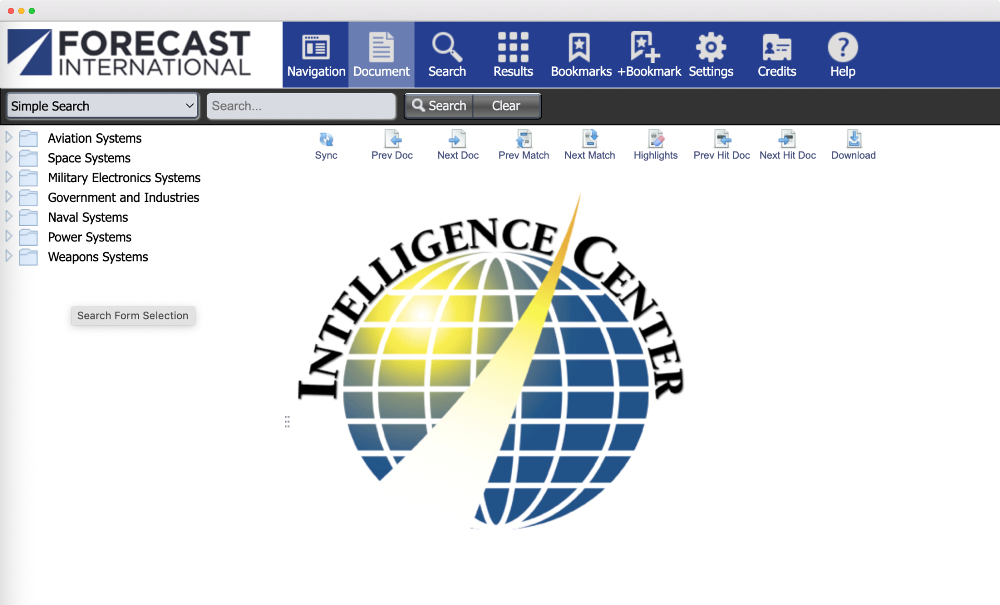
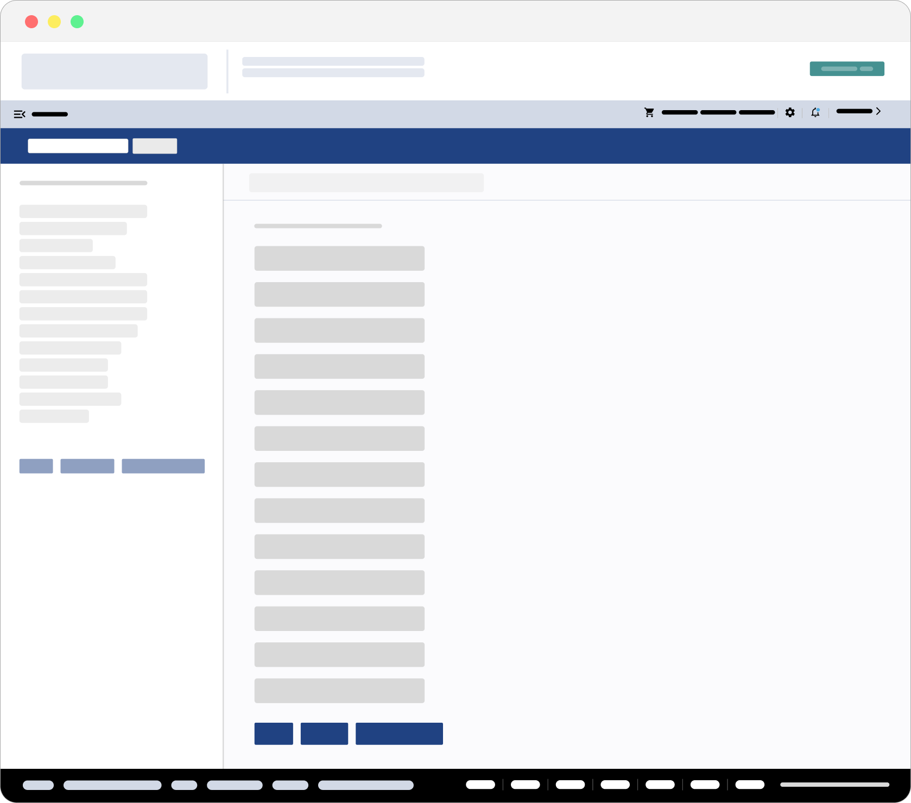

<h3>Redesigning the platform software for premier provider of market intelligence.</h3>

<ul class="projectdetails">
	<li>Project Completed 2023</li>
	<li>Project Role UX/UI Design, Branding, User Research, Management, Information Architecture</li>
</ul>

<h4>Background</h4>

As senior product designer, working for a B2B media corporation, I lead the initiative to update and enhance the marketing website and digital products for a newly acquired market forecasting company.

User surveys were conducted post acquisition that resulted in the identification of two key areas for improvement within the products.

<h4>Project Objectives</h4>

 Analysis from the user surveys showed flat user growth and declining user engagement within the organization’s most used products. Our primary objective for this initiative was to investigate the cause behind this and solutions to address it.

Screenshots of the platform prior to redesign.

Additionally, we set out to evolve and improve the design and brand experience to better meet user expectations.

Forms before and after

<h4>Strategy / Approach</h4>

The backend code base had many legacy constraints and would place a number of limits on the design. Because of this, the project was split into three phases; paid customer products, marketing homepage redesign, and finally, a full website. 

<h4>Execution</h4>

Analyzed and refined user flows to improve processes and add efficiencies. One instance resulted in a lead capture process going from five steps, down to two.

In all phases of the project we made it a priority to identified customer funnel improvements and review and update user flows. 

Components were redesigned to reflect the the new brand experience and increased emphasis on accessibility. 

Skeleton design of the platform

A chart page before redesign.

A chart page after redesign.

<h4>Results and Challenges</h4>

User engagement has shown six months of continued improvement

The homepage and website redesign are pending release.

The project was validated when the largest client granted access to the platform for their employee use.

Limited resources and stakeholder priorities caused this project to stall at times. I kept weekly communication with the different stakeholders to maintain project momentum.

Final designs for the platform

