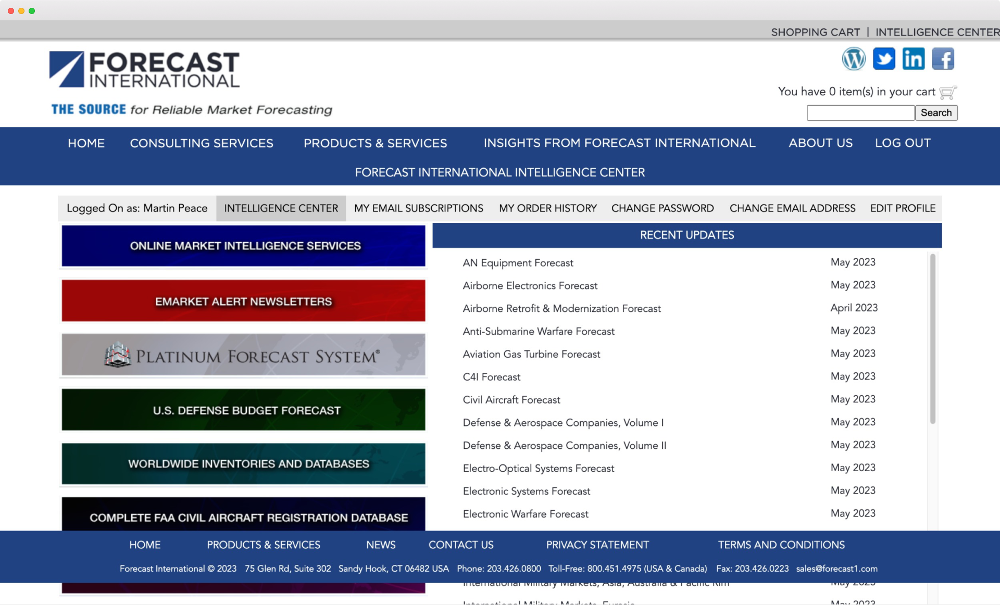
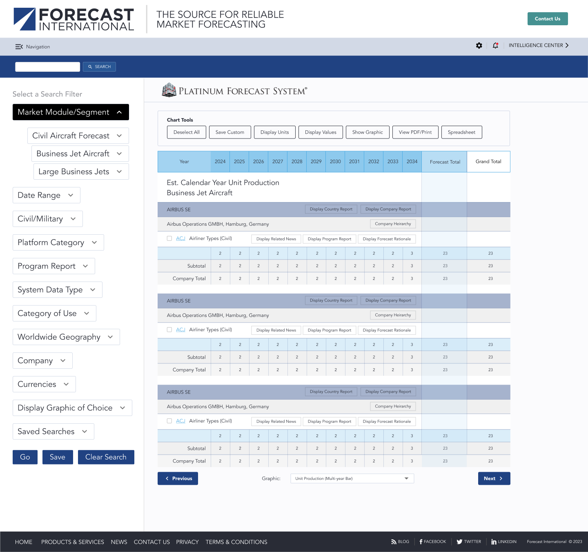

<h3>Redesigning the premier provider of market intelligence forecasting and proprietary research in Aerospace, Defense, Electronics and Power Systems industries.</h3>

<ul class="projectdetails">
	<li>Project Completed 2023</li>
	<li>Project Role UX/UI, Branding, User Research, Management, Information Architecture</li>
</ul>

<h4>Background</h4>

As senior product designer, working for a B2B media corporation, I lead the initiative to update and enhance the marketing website and digital products for a newly acquired market forecasting company.

User surveys were conducted post acquisition that resulted in the identification of two key areas for improvement within the products.

This is an image caption.

<h4>Project Objectives</h4>

 Analysis from the user surveys showed flat user growth and declining user engagement within the organization’s most used products. Our primary objective for this initiative was to investigate the cause behind this and solutions to address it.

This is an image caption.

Additionally, we set out to evolve and improve the design and brand experience to better meet user expectations.

This is an image caption.

<h4>Strategy / Approach</h4>

The backend code base had many legacy constraints and would place a number of limits on the design. Because of this, the project was split into three phases; paid customer products (?), marketing homepage (redesign?), and finally, a full website. 

This is an image caption.

<h4>Execution</h4>

Analyzed and refined user flows to improve processes and add efficiencies. One instance resulted in a lead capture process going rom five down to two steps.

Components were redesigned to reflect the the new brand experience and increased emphasis on accessibility. 

This is an image caption.

<h4>Results &amp; Metrics</h4>

User engagement has showed 6 months of continued improvement

Homepage is still unreleased. Site redesign is on hold.

This is an image caption.

<h4>Challenges</h4>

Putt the challenges here.

