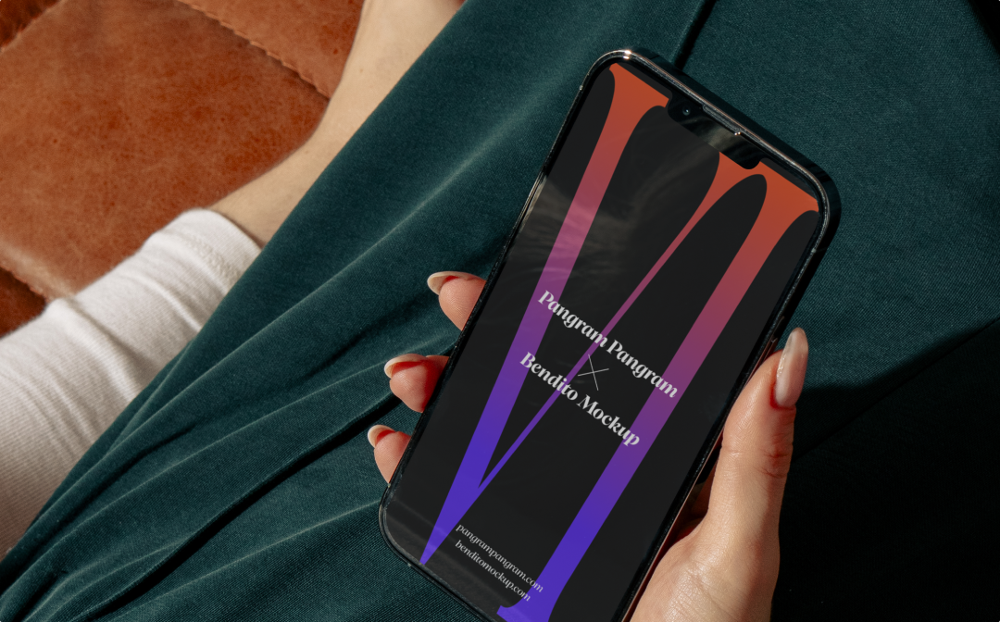

<h2>Design & Development Process</h2>
<h3>Redesigning the premier provider of market intelligence forecasting and proprietary research in Aerospace, Defense, Electronics and Power Systems industries.</h3>

<ul>
	<li>Project Completed 2023</li>
	<li>Project Role UX/UI, Branding, User Research, Management, Information Architecture</li>
</ul>

<h4>Background</h4>

I was working with a market forecasting company to update and improve their digital products and marketing site. As part of a post-acquisition integration initiative, we finalized this project in the fall of 2022, streamlining their existing products to integrate effortlessly with established product lines and brand experiences.

However, their products were encountering challenges, specifically, stagnant user growth and engagement.  Identifying the root cause and potentially addressing this issue became critical in light of the merger. 

<h4>The Problem — User Expectations</h4>

Our primary objective in undertaking this project was to investigate the reasons behind the stagnation in user growth and engagement. The team conducted a user survey, distributing a concise questionnaire to our existing  user base. The survey aimed to understand why users utilized the product they paid for and their overall satisfaction with it. 

The insights gleaned from this survey were invaluable, revealing that users found the product unattractive, challenging to navigate, and outdated in appearance. However, they also expressed a strong appreciation for the valuable data provided by the platform, which motivated them to maintain their memberships. Armed with this information, we were poised to devise a solution.

