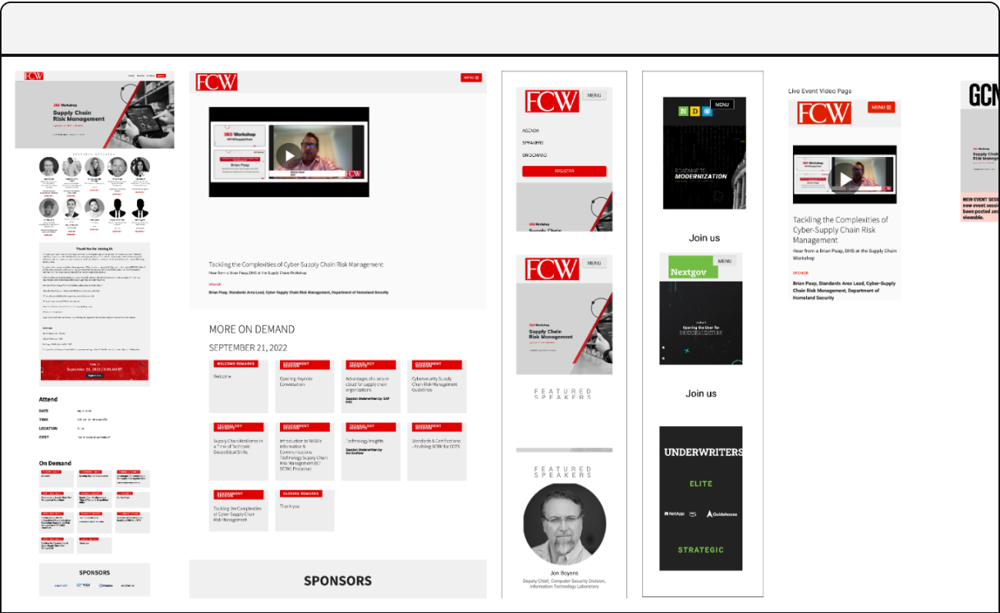
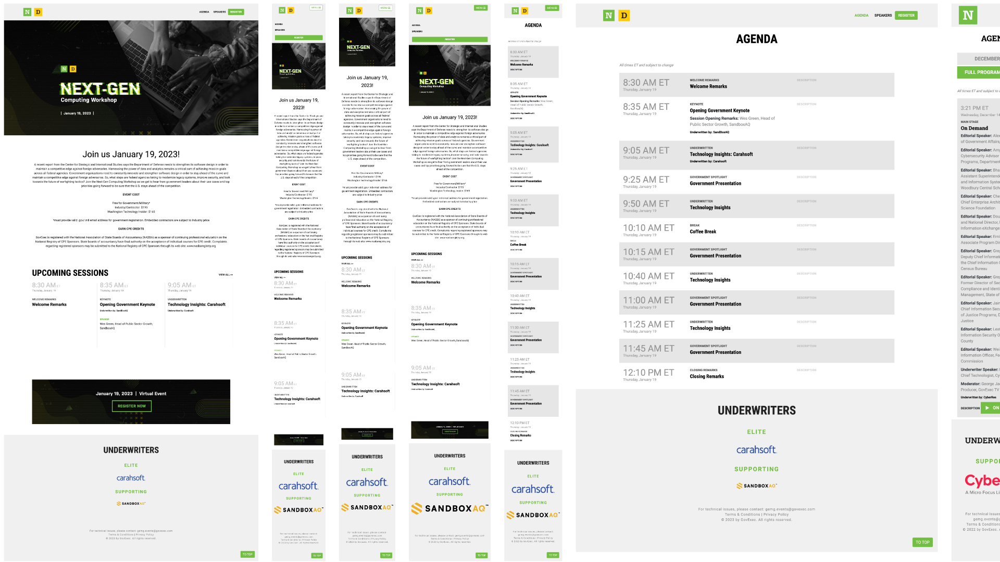
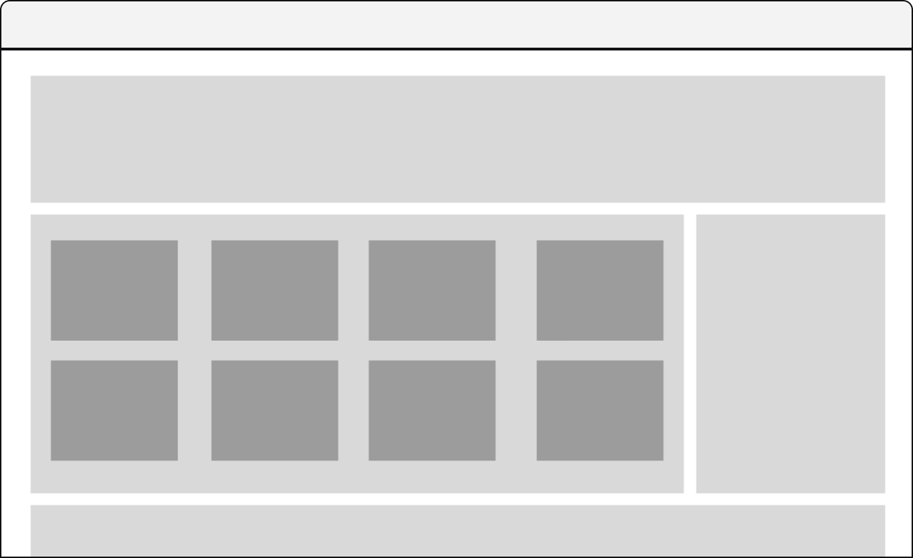
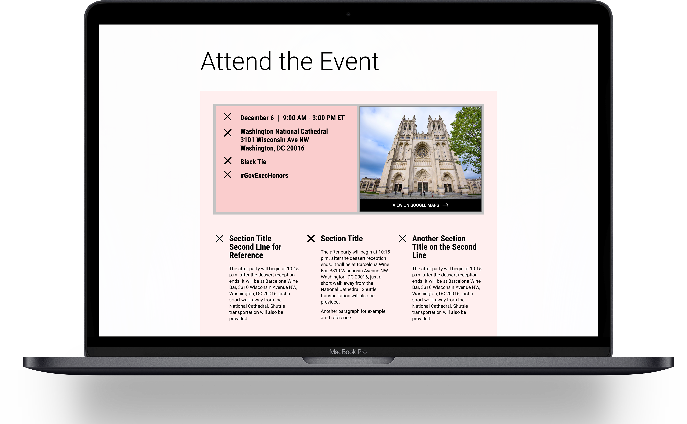
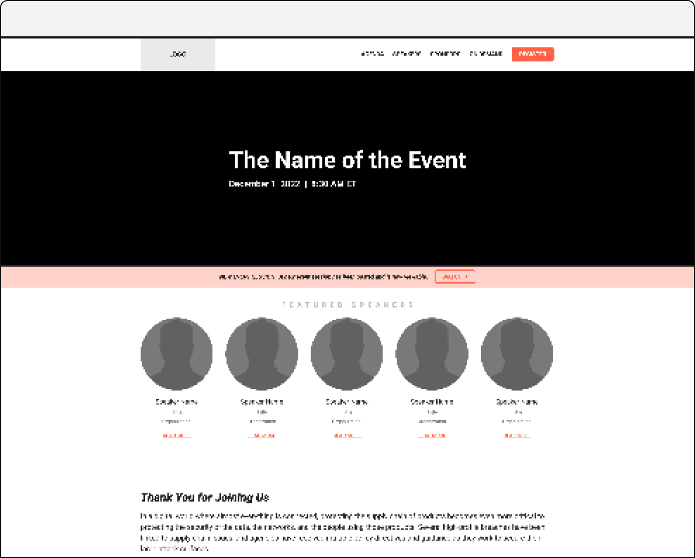

<h3>Designing and scaling an event management app from 25 users to over 300 users and from 24 events to over 200 events a year.</h3>

<ul>
	<li>Project Completed 2024</li>
	<li>Project Role UX/UI Design, Branding, Management, Information Architecture</li>
</ul>

<h4>Background</h4>

I was working for a government news media company. Events were a major part of their business, leveraging the experience to create news, attention and clout for increased credibility for  media and the market. 

We wanted to run more events and more types of events as well as enable the existing stakeholders to bring on new users to the platform. We wanted to scale up and we needed an event solution to manage and facilitate all of this. We had an existing product that we could use and extend. This is how we scaled up and added dozens of features.

<h4>Audits</h4>

Audits were completed to surface any inconsistencies in the different components used on each event: who had access to create events, existing user flows and user journeys. Essentially, this stage we needed to identify all the modules and components that might come up while we add users to the platform through new company integrations.  Additionally, proving the effective role out would influence more of the new companies to adopt the in house option.

<h4>Design & On Going Development</h4>

The largest obstacle to overcome in this project was the need to reengage the EMS stakeholders as we scaled to onboard new acquisitions. As new companies were acquired, we were tasked with getting new users integrated into either a one off system they would pay for or our internal event product. 

Essentially, we had to convince them to use our product over an off-the-self solution. We would have kickoff meetings to scope the components and features these new users required to build and launch successful event websites, run through design iterations on these new features and typically deploy within a couple sprints. When we began the platform had roughly 30 users as scaled it would eventually support more that 300 concurrent event users. Additionally, over 500 events were setup and completed using the EMS platform in a little over two year period.

These were all points of success but we needed to continue to improve.
As

<h4>Steps / Method</h4>

Text goes here...

<!--

	<h4>Event Registration Redesign</h4>
	<h5>Background</h5>
	
The ongoing meetings and updates with our stakeholders lead us to investigating new ways to increase user engagement. Specifically, we were asked if we could get more people registered for the events or if they have partially filled out the registration form, could we get some of the information captured. Below you can see the form and note how long it is.

	
	<h5>Potential Solution</h5>
	
Initial discussions were over how long the registration form was and where all the data that was requested on the form went. Were we asking to much from the user? Did we really need all this information? Why did we need this information? I completed a very small questionnaire audit to align the data to one of our end user staff members. Ultimately, I was not able to get our team to reduce the number of items within the form. So, onto option two, convincing them of a multi step form design. This went over very well because it gave all the data stakeholders the data they wanted and potentially gave us the ability to capture different portions of the form by breaking it up into multiple steps. 

	
I worked through user flows to layout what this new process could look like and pulled an together initial design proposal. Management approved without any push back and we moved on to actually building out designs.

	
	<h5>Process</h5>
	
First, I completed an information analysis on the form elements. The goal was to asses and group the different form elements into groups that would each be a step in the form flow Additionally, I brought in the lead developer on the product to layout any of the constraints that we should be aware of. I would work with the product manager for the EMS product reviewing and iterating the designs until we had something that achieved what we were looking for. Below are the final stages of each grouping.

	
	<h5>Solution</h5>
	
The largest hurdle when designing these forms came from an unexpected but probably to be expected detail that was initially over looked, the privacy policy. We discussed back and forth the different implications of placing the privacy policy on different screens and how the user might interrupt experiencing the policy in unexpected places. We consulted our legal team and that would settle most of disagreement. We would end up having to place the privacy notice on the very first screen.

	
I presented the final designs and received approval to continue to handoff to our developers.

	
	
	

-->

<h4>Solution & Reflections</h4>

Building out this platform initially started very small but as we performed user research and user interviews we were able to narrow down and build out very specific work flows and solutions. this propelled our events teams to eclipsing 500 events built out on this platforms in a just around two year span. 

See the events being produced on this platform over at <a href="https://govexec.com/events">govexec.com/events</a>. Below are a few screenshots of some of the completed event sites using this EMS platform.

You can actively see the events being produced on this platform over at govexec.com/events. Below are a few screenshots of some of the completed event sites using this EMS platform.

