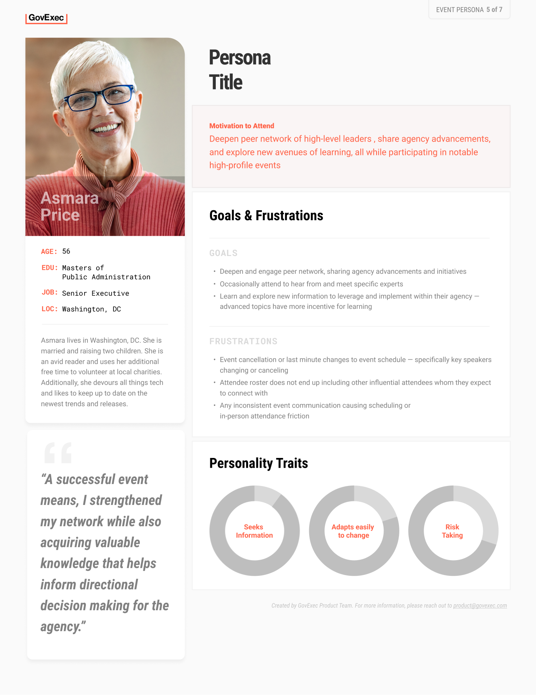

<h3>A summary of designing and scaling an event management app for a growing media business</h3>

<ul class="projectdetails">
	<li>Project Completed 2024</li>
	<li>Project Role UX/UI Design, Usability Testing, Branding, Management, Information Architecture</li>
</ul>

<h4>Background</h4>

Working for a leading government news media company,  I was responsible for maintaining and improving our in-house event management product, used for the creation and marketing of company events.

	

Following the completion of several acquisitions within a short period of time, evolving our event management product and processes to incorporate the new organizations became an important element of integration efforts.

<h4>Project Objectives</h4>

In preparation for this initiative, we identified three main objectives: 

<ul>
<li>Improve product efficiency while increasing product adoption</li>
<li>Increase and validate product credibility for our newly integrated businesses</li>
<li>Evolve our product with a focus on scalability to support a fast growing events business</li>
</ul>
	

A clipping of the audits that were completed of the existing platform.

<h4>Strategy / Approach</h4>

We put a significant focus on identifying potential new components that may be needed while we introduced new users to the platform. We needed to ensure a successful roll-out to establish credibility with the newly acquired businesses, and using the input from the newly acquired teams would create a comprehensive product requirements and features list.

	<h3>
		Additional Insight 
		Persona Research Process 
	</h3>
	

		
As the platform expanded, we encountered challenges defining our target audience. We created event attendee personas as a way to narrow and address these problems.Creating personas enabled us to enhance communication and identify product improvements across all teams.

		
Baseline research was provided from internal resources, allowing me to create eight generic profiles that we could validate in user interviews and additional stakeholder feedback.

		
		
Initial layout exploration used during interviews
		
		
		
Worksheet used in collaborative meeting discussions

		
I completed user interviews over multiple sessions, leveraging online collaborative whiteboards for direct stakeholder feedback and input.  The interview data was analyzed and summarized resulting in seven personas.

		
As part of the persona roll-out, I held multiple on-boarding and how-to sessions to help introduce the personas to the different teams.
	
		
In one unexpected usefulness of the personas, the events team implemented the personas as part of their new hire on-boarding process, reviewing the markets and users they would be interacting with.

		
		<h5>Results</h5>
		
Additionally, the personas were critical in the design and development of multi-step forms for event registration.

		
		
		
	

<h4>Execution</h4>

Through an iterative stakeholder focused design process, I designed roughly 20 components that are now deployed and usable within the product. Both front and back end interfaces are accounted for in this project. Additional time was used working with the software engineers to make sure designs matched and accounted for the different individual brand requirements.

<!--

	<h4>Event Registration Redesign</h4>
	<h5>Background</h5>
	
The ongoing meetings and updates with our stakeholders lead us to investigating new ways to increase user engagement. Specifically, we were asked if we could get more people registered for the events or if they have partially filled out the registration form, could we get some of the information captured. Below you can see the form and note how long it is.

	
	<h5>Potential Solution</h5>
	
Initial discussions were over how long the registration form was and where all the data that was requested on the form went. Were we asking to much from the user? Did we really need all this information? Why did we need this information? I completed a very small questionnaire audit to align the data to one of our end user staff members. Ultimately, I was not able to get our team to reduce the number of items within the form. So, onto option two, convincing them of a multi step form design. This went over very well because it gave all the data stakeholders the data they wanted and potentially gave us the ability to capture different portions of the form by breaking it up into multiple steps. 

	
I worked through user flows to layout what this new process could look like and pulled an together initial design proposal. Management approved without any push back and we moved on to actually building out designs.

	
	<h5>Process</h5>
	
First, I completed an information analysis on the form elements. The goal was to asses and group the different form elements into groups that would each be a step in the form flow Additionally, I brought in the lead developer on the product to layout any of the constraints that we should be aware of. I would work with the product manager for the EMS product reviewing and iterating the designs until we had something that achieved what we were looking for. Below are the final stages of each grouping.

	
	<h5>Solution</h5>
	
The largest hurdle when designing these forms came from an unexpected but probably to be expected detail that was initially over looked, the privacy policy. We discussed back and forth the different implications of placing the privacy policy on different screens and how the user might interrupt experiencing the policy in unexpected places. We consulted our legal team and that would settle most of disagreement. We would end up having to place the privacy notice on the very first screen.

	
I presented the final designs and received approval to continue to handoff to our developers.

	
	
	

-->

<h4>Challenges and Solutions</h4>

The largest obstacle to overcome in this initiative was the need to reengage product stakeholders multiple times as we scaled to support the onboarding of several newly acquired businesses.

	

As new companies were acquired, they were given the choice to remain with an external events management system or integrate and help fund our internal event product. Essentially, our challenge was to convince them to use our product over an external solution.

<h4>Results and Metrics</h4>

Our team designed and scaled an event management app that evolved from just 25 to over 300 users and from 24 to over 200 events a year. More than 500 events were produced in roughly a two year period using the event software.

Additionally, we brought all major company events underneath a single platform, successfully integrating all the different brands and companies that had been acquired.

Below are screenshots of the event product.

