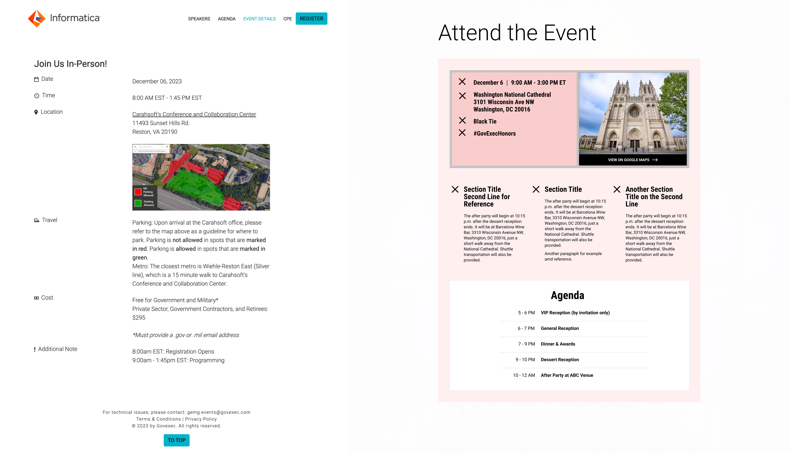

<h3>Building out and scaling an event management app from 25 to over 300 users and from 24 to over 200 events a year.</h3>

<ul class="projectdetails">
	<li>Project Completed 2024</li>
	<li>Project Role UX/UI Design, Branding, Management, Information Architecture</li>
</ul>

<h4>Background</h4>

Working for a leading government news media company,  I was responsible for maintaining and improving our in-house software used for the management and marketing of company events.

	

Following the completion of several acquisitions within a short period of time, evolving our event management app and processes to incorporate the new organizations became an important element of integration efforts.

<h4>Project Objectives</h4>

In preparation for this initiative, we identified three main objectives: 

<ul>
<li>Improve product efficiency while increasing active users</li>
<li>Increase and validate product credibility for our newly integrated businesses</li>
<li>Evolve our product with a focus on scalability to support a fast growing events business.</li>
</ul>
	

Audits were completed of the existing platform.

<h4>Strategy / Approach</h4>

 During this stage we put a  significant focus on identifying  potential new components that may be needed  while we introduced new users to the platform as a part of post acquisition integrations.  And simultaneously ensure a successful roll-out to establish credibility with the newly acquired businesses, leading to increased adoption.

<h5>Personas Research</h5>

We created event attendee personas as a way to better communicate product improvements across all the teams. Baseline research was provided from subsidiary company that I used to create eight profiles that we then validated and improved through stakeholder interviews.

Completed interviews and analyzed and summarized the collected data. Designed seven personas. That  I presented to company. The personas were vital in the research we needed to complete another project, multi-step form registration.

<h4>Execution</h4>

Through an iterative stakeholder focus design process, I designed 20 components that can now be used within the events platform and numerous additional features.

This is an image caption.

<!--

	<h4>Event Registration Redesign</h4>
	<h5>Background</h5>
	
The ongoing meetings and updates with our stakeholders lead us to investigating new ways to increase user engagement. Specifically, we were asked if we could get more people registered for the events or if they have partially filled out the registration form, could we get some of the information captured. Below you can see the form and note how long it is.

	
	<h5>Potential Solution</h5>
	
Initial discussions were over how long the registration form was and where all the data that was requested on the form went. Were we asking to much from the user? Did we really need all this information? Why did we need this information? I completed a very small questionnaire audit to align the data to one of our end user staff members. Ultimately, I was not able to get our team to reduce the number of items within the form. So, onto option two, convincing them of a multi step form design. This went over very well because it gave all the data stakeholders the data they wanted and potentially gave us the ability to capture different portions of the form by breaking it up into multiple steps. 

	
I worked through user flows to layout what this new process could look like and pulled an together initial design proposal. Management approved without any push back and we moved on to actually building out designs.

	
	<h5>Process</h5>
	
First, I completed an information analysis on the form elements. The goal was to asses and group the different form elements into groups that would each be a step in the form flow Additionally, I brought in the lead developer on the product to layout any of the constraints that we should be aware of. I would work with the product manager for the EMS product reviewing and iterating the designs until we had something that achieved what we were looking for. Below are the final stages of each grouping.

	
	<h5>Solution</h5>
	
The largest hurdle when designing these forms came from an unexpected but probably to be expected detail that was initially over looked, the privacy policy. We discussed back and forth the different implications of placing the privacy policy on different screens and how the user might interrupt experiencing the policy in unexpected places. We consulted our legal team and that would settle most of disagreement. We would end up having to place the privacy notice on the very first screen.

	
I presented the final designs and received approval to continue to handoff to our developers.

	
	
	

-->

<h4>Challenges and Solutions</h4>

The largest obstacle to overcome in this initiative was the need to reengage the EMS stakeholders as we scaled to support the onboarding of several newly acquired businesses.

	

As new companies were acquired, they were given the choice to remain with an external events management  system or integrate and help fund our internal event product. Essentially, our challenge was to convince them to use our product over an external solution.

<h4>Results and Metrics</h4>

A successfully scaled  event management app that evolved from just 25 to over 300 users and from 24 to over 200 events a year. More than 500 events were produced in roughly a two year period using our event software.

Additionally we brought all major company events underneath a single platform.

A completed event using the event platform.

